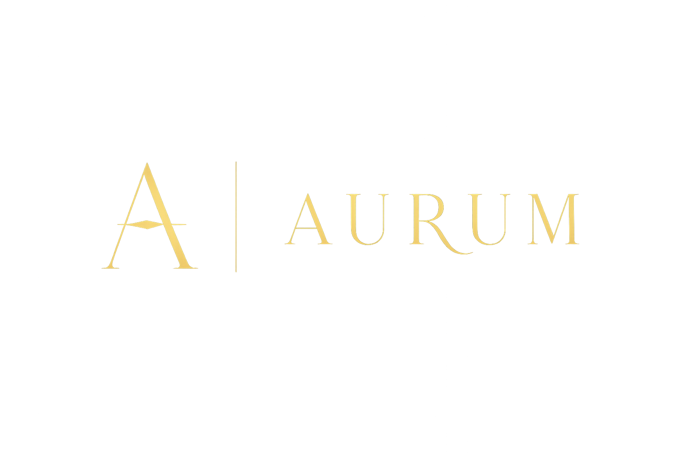

<div align="center">
  <br />
  
  <br />
  <br />

  # AURUM
  **The Digital Maison of Fine Jewellery**
</div>

## 🌌 Overview
AURUM is a highly immersive, ultra-luxury e-commerce platform built for high-end jewellery. Combining cinematic scroll animations, generative 3D WebGL models, and a sleek dark-mode aesthetic, AURUM redefines the luxury shopping experience for the modern digital era.

## ✨ Features
- **Cinematic 3D Scroll Experience:** Powered by GSAP and React Three Fiber, telling the story of each piece from stardust to the showroom.
- **Generative 3D Models:** Procedurally generated gold and diamond models that react to scroll and user interactions.
- **Ultra-Luxury UI/UX:** A bespoke design system using Tailwind CSS, featuring glassmorphism, smooth micro-animations, and a curated color palette (Obsidian, Gold, Cream).
- **Full E-Commerce Flow:** Seamlessly browse collections, add to cart, and checkout with Razorpay integration.
- **Maison Admin Dashboard:** Secure admin portal with NextAuth to manage the product catalogue with drag-and-drop image uploads.
- **Robust Backend:** Next.js Server Actions, Drizzle ORM, and Neon Serverless Postgres for blazing-fast data handling.

## 🛠️ Tech Stack
- **Framework:** [Next.js 14](https://nextjs.org/) (App Router)
- **Styling:** [Tailwind CSS](https://tailwindcss.com/) & Framer Motion
- **3D & Animation:** [React Three Fiber](https://docs.pmnd.rs/react-three-fiber), Drei, Postprocessing, [GSAP](https://gsap.com/)
- **Database:** [NeonDB (PostgreSQL)](https://neon.tech/), [Drizzle ORM](https://orm.drizzle.team/)
- **Authentication:** [NextAuth.js v5 (Auth.js)](https://authjs.dev/) with Google OAuth
- **Payments:** [Razorpay](https://razorpay.com/)
- **State Management:** [Zustand](https://zustand-demo.pmnd.rs/)

## 🚀 Getting Started

### Prerequisites
- Node.js 18+
- NeonDB Account
- Google Cloud Console Project (for OAuth)
- Razorpay Test Account

### Installation

1. **Clone the repository:**
   ```bash
   git clone https://github.com/Kavya-Jain-coder/AURUM.git
   cd AURUM
   ```

2. **Install dependencies:**
   ```bash
   npm install
   ```

3. **Set up environment variables:**
   Create a `.env.local` file in the root directory and add your keys (refer to the dummy `.env.local` format).

4. **Initialize Database:**
   ```bash
   npx drizzle-kit push --dialect postgresql --schema src/lib/schema.ts --url "YOUR_NEON_DATABASE_URL"
   ```

5. **Run the development server:**
   ```bash
   npm run dev
   ```
   Open [http://localhost:3000](http://localhost:3000) to view the application.

## 💼 Admin Portal
Access the admin portal by navigating to `/admin`.
Authentication requires an Admin Google account configured via NextAuth. Admins can view metrics, list new products, and drag-and-drop product imagery directly into the live catalogue.
